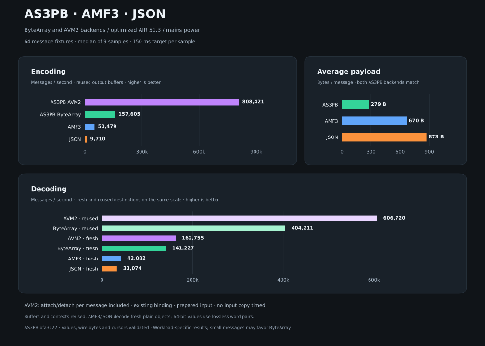
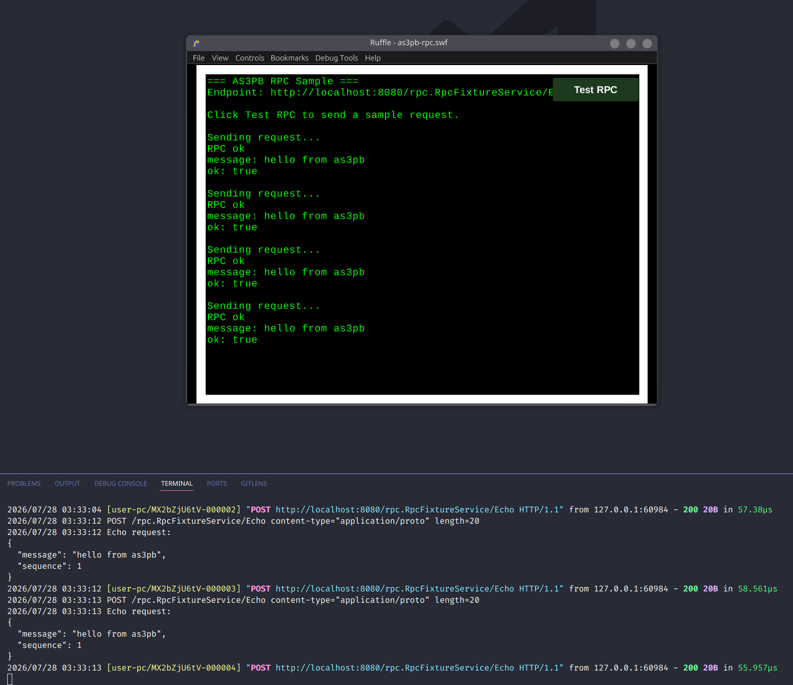

# AS3PB

AS3PB is a Protocol Buffers code generator and runtime for ActionScript 3, designed for compact wire payloads and low-allocation game/runtime use.



The repository contains:

- `protoc-gen-as3`, the protoc plugin that emits AS3 message, enum, and RPC client code.
- `as3-protoc`, a small wrapper for invoking protoc with the AS3 generator.
- `runtime/`, the AS3 runtime support library used by generated code.
- `examples/`, a small generated example schema.
- `runtime/test/`, runtime fixtures, tests, benchmark, and RPC sample.

## Conformance

The binary wire format is validated against the official
[protobuf conformance suite](https://github.com/protocolbuffers/protobuf/tree/main/conformance)
(v35.1) for proto3 and for editions files using the proto3 feature
set: 1404 tests pass with 0 unexpected failures, including
unknown-field preservation. The harness, current results, and the one
deliberate deviation (invalid UTF-8 in strings is accepted) live in
[as3pb-conformance](https://github.com/33TU/as3pb-conformance).

Editions files (2023 and 2024) may additionally use explicit field
presence (`features.field_presence = EXPLICIT`, generated as nullable
fields like proto3 `optional`: `OptionalInt`, `OptionalBoolean`, and
friends for scalars) and declared defaults (`default = ...`,
generated as `DEFAULT_*` constants). Defaults are never pre-loaded
into the field — unset remains null so presence round-trips — and
callers substitute the constant at read time:
`msg.speed != null ? msg.speed.value : Config.DEFAULT_SPEED`.

JSON, text format, proto2, and the editions features outside proto3
semantics (extensions, delimited encoding, closed enums) are out of
scope for the runtime and are skipped by the suite.

## Codegen Speed

One run over a 109-file production schema (~950 generated classes),
protoc 35.1, warm cache, plugin startup included:

| Generator                  | Time   | Files |
| -------------------------- | ------ | ----- |
| python (in-process)        | 0.11 s | 107   |
| **as3-protoc**             | 0.24 s | 925   |
| java (in-process)          | 0.80 s | 107   |
| C++ (in-process)           | 1.30 s | 214   |
| protobuf-ts 2.11 (plugin)  | 1.63 s | 113   |

File counts reflect language layout conventions, not output volume:
AS3 requires one public class per file and has no nested classes, so
every message, map entry, enum, and service client is its own file.
The in-process generators run inside protoc itself; as3-protoc pays
the full plugin round trip (descriptor marshalling plus a subprocess)
and generation is still effectively instant, so regenerating on every
schema change costs nothing.

## Requirements

For generator usage:

- Go
- protoc

For local development and runtime builds:

- Just
- AIR SDK with `mxmlc` and `compc` on PATH

The AIR SDK can be downloaded with:

```sh
just download-air-sdk
```

You can also pass an OS explicitly:

```sh
just download-air-sdk linux
just download-air-sdk mac
just download-air-sdk windows
```

After downloading, add the SDK `bin` directory to PATH before building AS3 targets.

## Install

Install the generator and protoc wrapper with Go:

```sh
go install github.com/33TU/as3pb/cmd/protoc-gen-as3@latest
go install github.com/33TU/as3pb/cmd/as3-protoc@latest
```

For local development, build them into `bin/`:

```sh
just build-protoc-gen-as3
just build-as3-protoc
```

## Generate AS3

The easiest way to generate AS3 code is `as3-protoc`. It invokes `protoc`, configures `protoc-gen-as3`, and adds proto import mappings for you:

```sh
as3-protoc -I proto --as3_out=generated proto/game.proto
```

When using local development binaries:

```sh
bin/as3-protoc \
  --protoc_gen_as3_bin=bin/protoc-gen-as3 \
  -I examples/proto \
  --as3_out=examples/generated \
  examples/proto/game.proto
```

You can also invoke `protoc-gen-as3` directly through `protoc`:

```sh
protoc \
  --plugin=protoc-gen-as3=protoc-gen-as3 \
  --as3_opt=Mgame.proto=as3.pb \
  --as3_out=generated \
  -I proto \
  proto/game.proto
```

Direct `protoc` usage requires imported proto files to have usable Go package metadata or explicit `Mfile.proto=package` mappings. The `as3-protoc` wrapper adds those mappings automatically by scanning include paths.

Proto3 `optional` fields preserve presence. Scalar values use nullable wrappers such
as `OptionalInt` and `OptionalBoolean`; 64-bit values, strings, bytes, and
messages are nullable reference types. A non-null value is serialized even when
it contains the protobuf default.

Generator options can be passed with `--as3_opt`:

```sh
as3-protoc \
  -I proto \
  --as3_out=generated \
  --as3_opt=generate_any=true \
  --as3_opt=generate_serialize=true \
  --as3_opt=generate_deserialize=true \
  proto/game.proto
```

Available options:

- `debug`: print generator debug logs.
- `generate_always`: generate files even when protoc did not mark them for generation, except bundled Google protobuf types.
- `indent`: set the generated indentation string. Defaults to four spaces.
- `inline_reset`: emit `[Inline]` on generated reset methods. Defaults to true.
- `generate_any`: emit message type URLs and automatic `AnyRegistry` registration. Defaults to true.
- `generate_clone`: emit `clone` methods. Defaults to true. The linker
  strips unused classes but never unused methods, so disabling this
  saves real SWF bytes when the app never clones messages.
- `generate_serialize`: emit `serializeBytes` methods. Defaults to true.
- `generate_deserialize`: emit `deserializeBytes` methods. Defaults to true.
- `generate_serialize_memory`: emit `serializeMemory` methods. Defaults to false.
- `generate_deserialize_memory`: emit `deserializeMemory` methods. Defaults to false.

The same options can be set with environment variables:

- `AS3PB_DEBUG`
- `AS3PB_GENERATE_ALWAYS`
- `AS3PB_INDENT`
- `AS3PB_INLINE_RESET`
- `AS3PB_GENERATE_ANY`
- `AS3PB_GENERATE_CLONE`
- `AS3PB_GENERATE_SERIALIZE`
- `AS3PB_GENERATE_DESERIALIZE`
- `AS3PB_GENERATE_SERIALIZE_MEMORY`
- `AS3PB_GENERATE_DESERIALIZE_MEMORY`

See [the memory backend guide](runtime/MEMORY.md) for the opt-in AVM2 APIs and context lifecycle.

## Use The Runtime

Generated AS3 code depends on the runtime package in `runtime/src/as3pb`.

For performance-sensitive projects, copy or vendor `runtime/src/as3pb` into your AS3 project and compile it together with your generated code. This lets the AS3 compiler see runtime `[Inline]` methods while compiling the final SWF.

Example layout:

```text
src/
generated/
vendor/as3pb/
```

Example compile source paths:

```sh
mxmlc \
  -source-path src \
  -source-path generated \
  -source-path vendor \
  src/Main.as
```

You can also build the runtime as a SWC:

```sh
just build-swc
```

Using the runtime source is recommended for game/runtime builds where inlining and allocation behavior matter. The SWC is convenient for packaging, IDE setup, or projects that prefer binary library dependencies.

### Explicit decode lengths

`Message.deserializeBytes(input, destination, length, reset = true)` requires
both `destination` and `length`. Pass an existing message to reuse it, or `null`
to allocate. `length` is a byte count from `input.position`; zero means an empty
message and returns after allocation/reset without reading or moving the cursor,
even past EOF. `reset = false` retains the existing merge behavior.

```actionscript
Message.deserializeBytes(input, existing, frameLength);
const fresh:Message = Message.deserializeBytes(input, null, input.bytesAvailable);
```

This changes the previous API: omitted destinations/limits and `limit = 0` no
longer mean decode all remaining bytes. Convert an old absolute `end` argument
to `end - input.position`, or explicitly pass `input.bytesAvailable` to decode
the remainder. Regenerate existing messages and update callers together.

## Commands

List available recipes:

```sh
just
```

Run Go tests:

```sh
just test
```

Build the Go tools and AS3 runtime SWC:

```sh
just build
```

Build individual Go tools:

```sh
just build-protoc-gen-as3
just build-as3-protoc
```

Build the runtime SWC:

```sh
just build-swc
```

The runtime-provided Google protobuf types ship with both ByteArray and memory methods. Regenerate them with:

```sh
just generate-google-protobuf
```

This uses `/usr/include/google/protobuf` by default. Set `GOOGLE_PROTOBUF_PATH`
when the protobuf include files are installed elsewhere:

```sh
GOOGLE_PROTOBUF_PATH=/path/to/include/google/protobuf just generate-google-protobuf
```

## Runtime Tests And Samples

Generate AS3 runtime fixture code:

```sh
just generate-runtime-test-data
```

Build the runtime test SWF:

```sh
just build-runtime-test
```

Build the benchmark SWF:

```sh
just build-runtime-bench
```

For a current comparison of ByteArray, opt-in AVM2, AMF3 and JSON with reused output
buffers and separate fresh/reused decoding, see [the format benchmark](runtime/bench/README.md#amf3-and-json-comparison).

Historical Flash Player result for the included benchmark fixture:


```text
Messages: 100
Iterations: 300

Protocol Buffers avg: 285 bytes/message
JSON avg: 718 bytes/message
AMF3 avg: 593 bytes/message
JSON/Proto size ratio: 2.52x
AMF3/Proto size ratio: 2.09x

Protocol Buffers serialize: 85ms
JSON serialize: 1608ms
AMF3 serialize: 197ms
JSON/Proto serialize ratio: 18.92x
AMF3/Proto serialize ratio: 2.32x

Protocol Buffers deserialize: 35ms
JSON deserialize: 283ms
AMF3 deserialize: 374ms
JSON/Proto deserialize ratio: 8.09x
AMF3/Proto deserialize ratio: 10.69x

Protocol Buffers total: 120ms
JSON total: 1891ms
AMF3 total: 571ms
JSON/Proto total ratio: 15.76x
AMF3/Proto total ratio: 4.76x
```

Generated RPC methods accept an optional typed response destination after the
timeout argument, for example `client.echo(request, onComplete, onError, 0, response)`.
The decoded response is reset and populated in place, and the callback receives
that same object. Omit it or pass `null` to allocate a response. Callers manage
its lifetime: do not share a destination between overlapping calls, and remember
that subsequent reuse changes references retained by previous callbacks.

Build the RPC sample SWF:

```sh
just build-runtime-rpc
```

Run the Go RPC fixture server used by the RPC sample:

```sh
just run-runtime-rpc-server
```

The RPC server is a nested Go module in `runtime/test/rpc-server`. Its Go protobuf and Connect stubs are generated from `runtime/test/data/rpc.proto` with:

```sh
just generate-runtime-rpc-server
```



## Examples

Regenerate example AS3 output:

```sh
just generate-examples
```

Build the examples SWC:

```sh
just build-examples
```

## License

AS3PB is available under the [MIT License](LICENSE).
