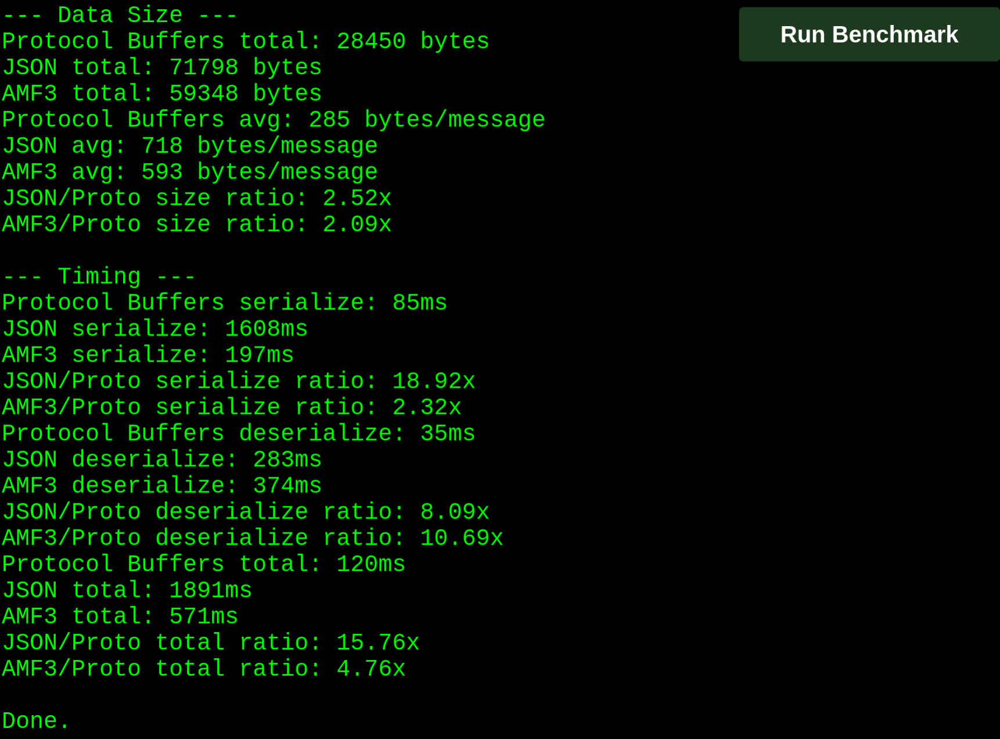

# AS3PB

AS3PB is a Protocol Buffers code generator and runtime for ActionScript 3, designed for compact wire payloads and low-allocation game/runtime use.

The repository contains:

- `protoc-gen-as3`, the protoc plugin that emits AS3 message, enum, and RPC client code.
- `as3-protoc`, a small wrapper for invoking protoc with the AS3 generator.
- `runtime/`, the AS3 runtime support library used by generated code.
- `examples/`, a small generated example schema.
- `runtime/test/`, runtime fixtures, tests, benchmark, and RPC sample.

## Requirements

- Go
- Just
- protoc
- AIR SDK with `mxmlc` and `compc` on PATH

The AIR SDK can be downloaded with:

```sh
just download-air-sdk
```

You can also pass an OS explicitly:

```sh
just download-air-sdk linux
just download-air-sdk mac
just download-air-sdk windows
```

After downloading, add the SDK `bin` directory to PATH before building AS3 targets.

## Commands

List available recipes:

```sh
just
```

Run Go tests:

```sh
just test
```

Build the Go tools and AS3 runtime SWC:

```sh
just build
```

Build individual Go tools:

```sh
just build-protoc-gen-as3
just build-as3-protoc
```

Build the runtime SWC:

```sh
just build-swc
```

## Runtime Tests And Samples

Generate AS3 runtime fixture code:

```sh
just generate-runtime-test-data
```

Build the runtime test SWF:

```sh
just build-runtime-test
```

Build the benchmark SWF:

```sh
just build-runtime-bench
```

Example Flash Player result for the included benchmark fixture:



```text
Messages: 100
Iterations: 300

Protocol Buffers avg: 285 bytes/message
JSON avg: 718 bytes/message
AMF3 avg: 593 bytes/message
JSON/Proto size ratio: 2.52x
AMF3/Proto size ratio: 2.09x

Protocol Buffers serialize: 85ms
JSON serialize: 1608ms
AMF3 serialize: 197ms
JSON/Proto serialize ratio: 18.92x
AMF3/Proto serialize ratio: 2.32x

Protocol Buffers deserialize: 35ms
JSON deserialize: 283ms
AMF3 deserialize: 374ms
JSON/Proto deserialize ratio: 8.09x
AMF3/Proto deserialize ratio: 10.69x

Protocol Buffers total: 120ms
JSON total: 1891ms
AMF3 total: 571ms
JSON/Proto total ratio: 15.76x
AMF3/Proto total ratio: 4.76x
```

Build the RPC sample SWF:

```sh
just build-runtime-rpc
```

Run the Go RPC fixture server used by the RPC sample:

```sh
just run-runtime-rpc-server
```

The RPC server is a nested Go module in `runtime/test/rpc-server`. Its Go protobuf and Connect stubs are generated from `runtime/test/data/rpc.proto` with:

```sh
just generate-runtime-rpc-server
```

## Examples

Regenerate example AS3 output:

```sh
just generate-examples
```

Build the examples SWC:

```sh
just build-examples
```
